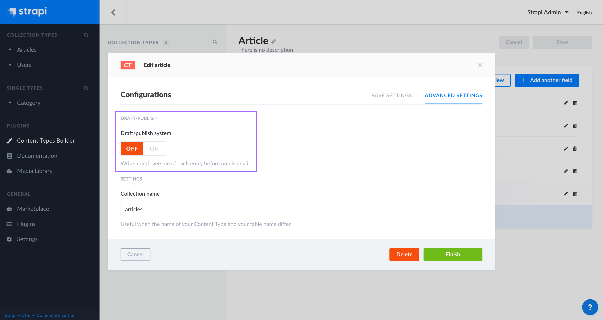
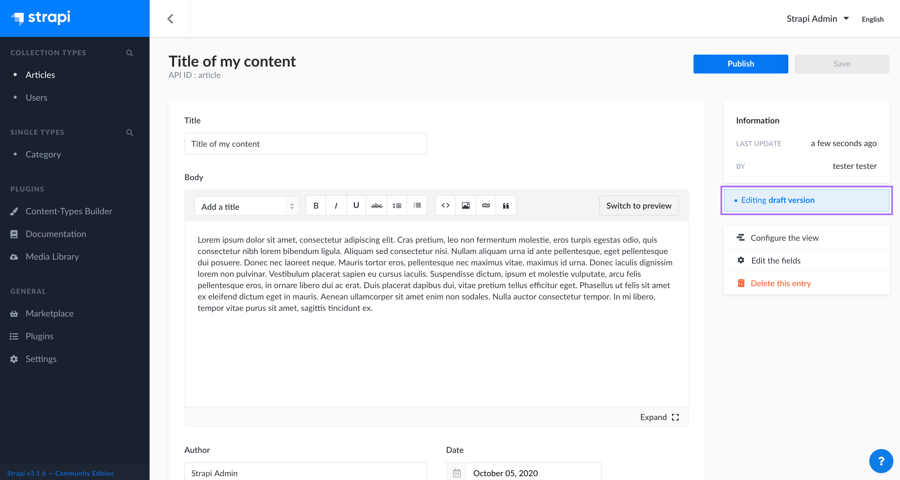

# Draft and publish

The draft and publish feature allows you to save your content as a draft, to publish it later.

## Activating or deactivating the draft and publish feature

By default, the draft and publish feature is activated for all newly created collection and single types. It is however possible to deactive the feature at content type level (i.e. it can be activated for one content type, but deactivated for another).

::: warning
If the feature is deactivated while contents are saved as drafts, they will automatically be deleted. Make sure all contents are published before deactivating the feature.
:::

To deactivate the draft and publish feature for a content type:

1. Go the Plugins > Content-Types Builder.
2. Select the collection or single type for which you want the draft and publish feature to be deactivated.
3. 点击 the Edit <Fa-PencilAlt /> button to access the content type's configurations.
4. 点击 the "Advanced Settings" tab.
5. In the DRAFT/PUBLISH section, click on the **OFF** button.
6. 点击 the **Finish** button to confirm the deactivation of the feature.

::: tip
It is also possible to activate or deactivate the feature when creating a new content type. To do so: after clicking on the **Create new collection/single type** button in the Content-Types Builder, follow steps 4 and 5 from the procedure above.
:::

## Switching from draft to published content

::: tip 注意
Publishing content may require specific roles and permissions. For example, in the Community version, the default roles grant permission to editors to publish content, but authors can only create and edit drafts.
:::

By default, each newly created content is a draft, which is indicated on the right of the interface, below the Information box.

Drafts can be modified and saved at will, until they are ready to be published.

### Publishing a draft

To publish a draft, click on the **Publish** button in the top right corner of the content editor.

::: warning CAUTION
Before publishing a draft, make sure it doesn't have relations with other non-published content, otherwise some of the content may not be available through the API.
:::

When a content is not a draft anymore, but has been published, it is indicated on the right of the interface, below the Information box.

### Unpublishing content

Published contents can be unpublished, switching back to being drafts again.

To unpublish content, click on the **Unpublish** button in the top right corner of the content editor.
