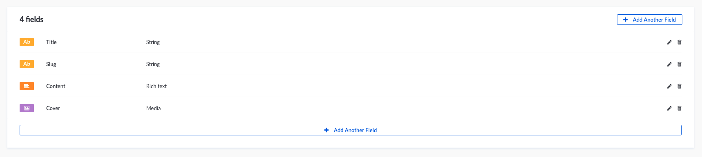
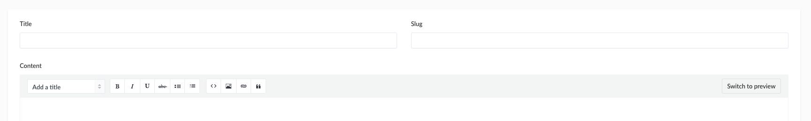
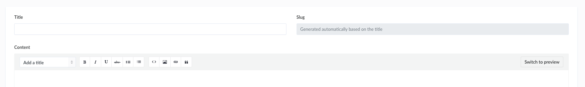
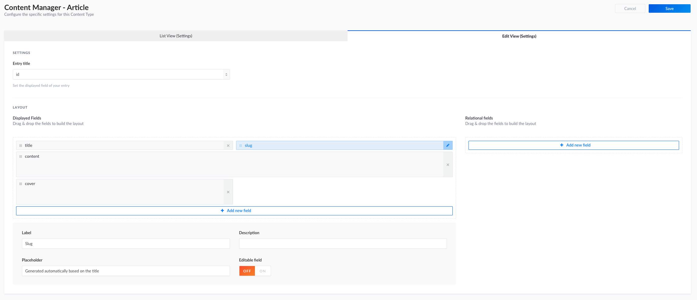

# 建立一个 slug 系统

本指南将解释如何创建一个 slug 系统的职位，文章或任何内容类型。

## 创建属性

要开始建造 slug 系统，你需要一个 `string` 字段作为 slug 的**基础**，在这个例子中我们将使用`title`。

您还需要另一个 `string` 字段，其中包含 `title` 的放大值，在这种情况下，我们将使用`slug`。



## 配置内容编辑器的布局

让我们配置 **edit page** 的布局，使其对内容编辑器更加友好。

- 点击 the **Article** link 在左边的菜单里.
- 然后 on the `+ Add New Article` 按钮
- And finally on the `Configure the layout` 按钮

在这里，我们将能够设置 `slug` 字段。

- 点击 the `slug` 字段
- 在页面底部, 编辑 **占位符** 值 `Generated automatically based on the title`.
- 点击 **OFF** for **Editable field** option.
- 不要忘记保存你的更新.

:::: tabs

::: tab View before



:::

::: tab View after



:::

::: tab View configuration



:::

::::

## 自动创建/更新 `slug` 属性

为此，您必须在应用程序中安装 `slugify` 节点模块。

完成后，您必须更新**文章**内容类型的生命周期，以自动完成 `slug` 字段 。

**Path —** `./api/article/models/Article.js`

:::: tabs

::: tab Mongoose

```js
const slugify = require('slugify');

module.exports = {
  lifecycles: {
    beforeCreate: async data => {
      if (data.title) {
        data.slug = slugify(data.title);
      }
    },
    beforeUpdate: async (params, data) => {
      if (data.title) {
        data.slug = slugify(data.title);
      }
    },
  },
};
```

:::

::: tab Bookshelf

```js
const slugify = require('slugify');

module.exports = {
  /**
   * Triggered before user creation.
   */
  lifecycles: {
    async beforeCreate(data) {
      if (data.title) {
        data.slug = slugify(data.title, { lower: true });
      }
    },
    async beforeUpdate(params, data) {
      if (data.title) {
        data.slug = slugify(data.title, { lower: true });
      }
    },
  },
};
```

:::

::::

## 获取文章 `slug`

这样你就可以用这个 `slug` 取你的 **Articles** 了。

你可以通过这个请求 `GET /articles?slug=my-article-slug` 找到你的文章
